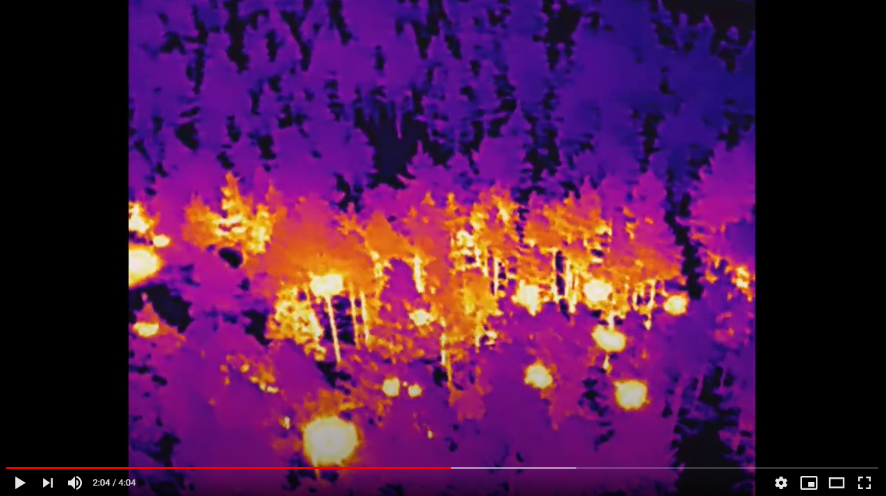

# Aerial Imagery dataset for fire detection: classification and segmentation using Unmanned Aerial Vehicle (UAV)

## Paper
<!--- just ou can find the **article** related to this code [here at IEEE](https://ieeexplore.ieee.org/abstract/document/8824917) or --->
You can find the **preprint** from the [Arxiv website](https://arxiv.org/pdf/2012.14036.pdf).

### Dataset
* The dataset is uploaded on IEEE dataport. You can find the dataset here at [IEEE Dataport](https://ieee-dataport.org/open-access/flame-dataset-aerial-imagery-pile-burn-detection-using-drones-uavs) or [DOI](https://dx.doi.org/10.21227/qad6-r683).

* This table shows all available data for the dataset.
* This project uses items 7, 8, 9, and 10 from the dataset. Items 7 and 8 are being used for the "Fire_vs_NoFire" image classification. Items 9 and 10 are for the fire segmentation. 
* If you clone this repository on your local drive, please download item [7](https://ieee-dataport.org/open-access/aerial-images-pile-fire-detection-using-drones-uavs) from the dataset and unzip in directory /frames/Training/... for the Training phase of the "Fire_vs_NoFire" image classification. The direcotry looks like this:
```
Repository/frames/Training
                    ├── Fire/*.jpg
                    ├── No_Fire/*.jpg
```
* For testing your trained model, please use item [8](https://ieee-dataport.org/open-access/aerial-images-pile-fire-detection-using-drones-uavs) and unzip it in direcotry /frame/Test/... . The direcotry looks like this:
```
Repository/frames/Test
                    ├── Fire/*.jpg
                    ├── No_Fire/*.jpg
```
* Items [9](https://ieee-dataport.org/open-access/aerial-images-pile-fire-detection-using-drones-uavs) and [10](https://ieee-dataport.org/open-access/aerial-images-pile-fire-detection-using-drones-uavs) should be unzipped in these directories frames/Segmentation/Data/Image/... and frames/Segmentation/Data/Masks/... accordingly. The direcotry looks like this:
```
Repository/frames/Segmentation/Data
                                ├── Images/*.jpg
                                ├── Masks/*.png
```

* Please remove other README files from those directories and make sure that only images are there. 


<!---  --->


### Model
* The binary fire classifcation model of this project is based on the Xception Network:


<br/>
<br/>

* The fire segmentation model of this project is based on the U-NET:


### Sample
* A short sample video of the dataset is available on YouTube:
[](https://youtu.be/bHK6g37_KyA "Sample video")

## Requirements
* os
* re
* cv2
* copy
* tqdm
* scipy
* numpy
* pickle
* random
* itertools
* Keras 2.4.0
* scikit-image
* Tensorflow 2.3.0
* matplotlib.pyplot

## Code
This code is run and tested on Python 3.6 on linux (Ubuntu 18.04) machine with no issues. There is a config.py file in this directoy which shows all the configuration parameters such as **Mode**, **image target size**, **Epochs**, **batch size**, **train_validation ratio**, etc. All dependency files are available in the root directory of this repository.
* To run the training phase for the "Fire_vs_NoFire" image classification, change the **mode** value to 'Training' in the config.py file. 
[Like This](https://github.com/AlirezaShamsoshoara/Fire-Detection-UAV-Aerial-Image-Classification-Segmentation-UnmannedAerialVehicle/blob/7f2999a33d7d6655dccfdd8a65c33373b5306794/config.py#L27)
```
Mode = 'Training'
```
Make sure that you have copied and unzipped the data in correct direcotry.

* To run the test phase for the "Fire_vs_NoFire" image classification, change the **mode** value to 'Classification' in the config.py file. 
[Change This](https://github.com/AlirezaShamsoshoara/Fire-Detection-UAV-Aerial-Image-Classification-Segmentation-UnmannedAerialVehicle/blob/7f2999a33d7d6655dccfdd8a65c33373b5306794/config.py#L27)
```
Mode = 'Classification'
```
Make sure that you have copied and unzipped the data in correct direcotry.

* To run the test phase for the Fire segmentation, change the **mode** value to 'Classification' in the config.py file. 
[Change This](https://github.com/AlirezaShamsoshoara/Fire-Detection-UAV-Aerial-Image-Classification-Segmentation-UnmannedAerialVehicle/blob/7f2999a33d7d6655dccfdd8a65c33373b5306794/config.py#L27)
```
Mode = 'Segmentation'
```
Make sure that you have copied and unzipped the data in correct direcotry.

Then after setting your parameters, just run the main.py file.
```
python main.py
```

## Results
* Fire classification accuracy:


* Fire classification Confusion Matrix:


<!---  --->

* Fire segmentation metrics and evaluation:


* Comparison between generated masks and grount truth mask:


## Citation
If you find it useful, please cite our paper as follows:
```
@article{shamsoshoara2020aerial,
  title={Aerial Imagery Pile burn detection using Deep Learning: the FLAME dataset},
  author={Shamsoshoara, Alireza and Afghah, Fatemeh and Razi, Abolfazl and Zheng, Liming and Ful{\'e}, Peter Z and Blasch, Erik},
  journal={arXiv preprint arXiv:2012.14036},
  year={2020}
}
```


## License
For academtic and non-commercial usage


